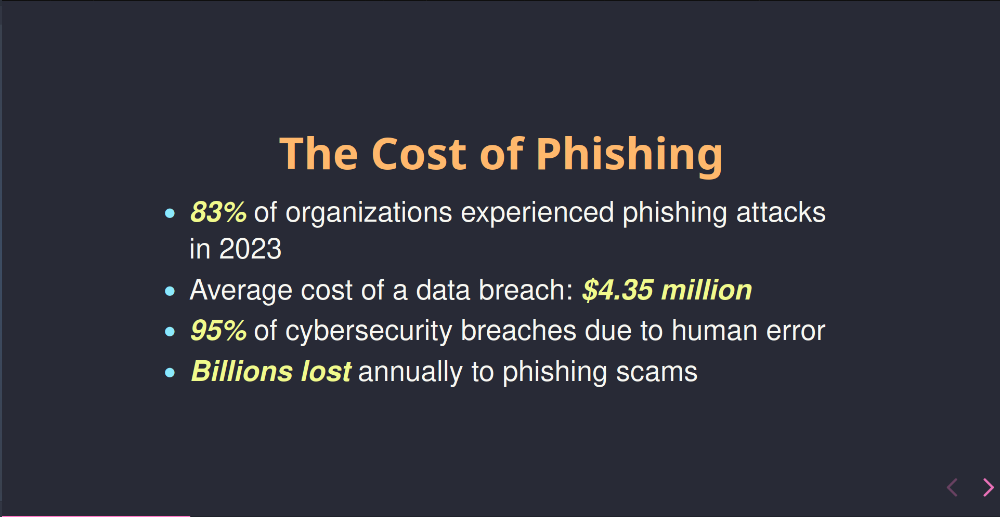

# Phishing Awareness Training

## Overview

This project aims to educate users about **phishing attacks** through an interactive presentation created with **Reveal.js**. The goal of the presentation is to raise awareness about the dangers of phishing emails, websites, and social engineering tactics, while engaging users with fun and interactive questions that test their understanding of the topic.

The presentation is designed to help users:
- Recognize phishing emails and websites.
- Understand common social engineering tactics.
- Take proactive steps to avoid falling victim to phishing attacks.

## Features

- Interactive, engaging questions throughout the presentation to test participants' understanding.
- Real-life examples of phishing emails and websites.
- Best practices to avoid phishing and stay safe online.
- Created with **Reveal.js** for a smooth, dynamic user experience.

## Screenshots



This is an example screenshot of the interactive phishing awareness presentation in action.

## How to Use

1. Clone the repository:

   ```bash
   git clone https://github.com/kraaakilo/CodeAlpha_Phishing_Awareness_Training.git
   cd CodeAlpha_Phishing_Awareness_Training
   ```

2. Open the `index.html` file in your browser to view the presentation.

3. Navigate through the presentation, answering interactive questions and learning how to recognize phishing attempts.
